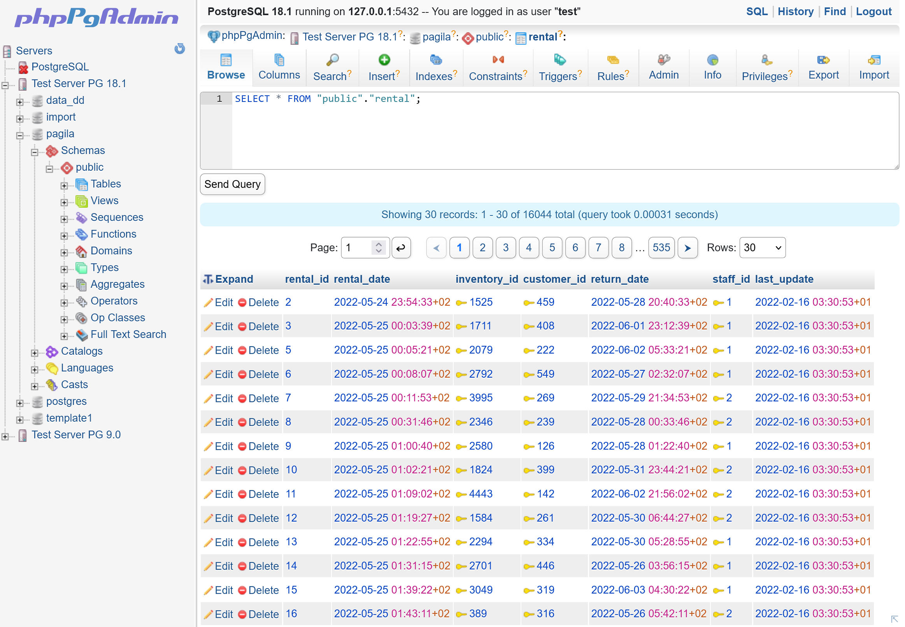

# phpPgAdmin


> **⚠️ DEVELOPMENT VERSION - NOT YET PRODUCTION READY**  
> This version is under development and should not be used in production environments. Features are being rewritten, tested, and may contain bugs or incomplete functionality. Use at your own risk.

**Modern web-based PostgreSQL administration tool** — Manage databases, schemas, tables, roles, queries, and backups through an intuitive web interface.

[](LICENSE)
[](https://php.net/)
[](https://www.postgresql.org/)

---

## 📖 Table of Contents

- [Overview](#overview)
- [Features](#features)
- [Requirements](#requirements)
- [Installation](#installation)
- [Configuration](#configuration)
- [Security](#security)
- [Documentation](#documentation)
- [Contributing](#contributing)
- [License](#license)
- [Credits](#credits)

---

## Overview

phpPgAdmin is a lightweight, web-based administration tool for PostgreSQL databases. It provides a comprehensive interface for database administrators, developers, and hosting providers to manage PostgreSQL servers without requiring command-line access.



**Built for:**

- Database administrators managing multiple PostgreSQL servers
- Developers requiring quick database access and query execution
- Hosting providers offering PostgreSQL database management to customers
- Teams needing collaborative database management

**Version:** 8.0  
**Project Homepage:** https://github.com/phppgadmin/phppgadmin

---

## Features

### Core Database Management

- **Multi-server support** - Manage multiple PostgreSQL servers from a single interface
- **Server grouping** - Organize servers into logical groups
- **Database operations** - Create, drop, rename, and alter databases
- **Schema management** - Full schema operations including creation, modification, and ownership changes
- **Table operations** - Create, alter, drop, truncate tables with advanced options
- **View management** - Create and manage views and materialized views (create, alter, drop). Materialized views can be created and refreshed (including `CONCURRENTLY` where supported); view dependencies and definitions are shown and manageable.
- **Sequence management** - Create, alter, and manage sequences
- **Function management** - Create, edit, and execute PostgreSQL functions
- **Trigger management** - Create and manage table triggers

### Data Management

- **Advanced SQL editor** - Ace Editor integration with syntax highlighting and autocomplete
- **Query execution** - Execute SQL queries with result pagination
- **Data browsing** - Browse table data with sorting, filtering, and pagination
- **Data editing** - Insert, update, and delete rows with foreign key autocomplete
- **Query history** - Track and reuse previously executed queries
- **Full-text search** - Manage full-text search configurations and dictionaries

### Import/Export

- **Unified export architecture** - Stream large exports efficiently
- **Multiple export formats:**
    - SQL (INSERT statements, single or multi-row)
    - PostgreSQL COPY format
    - CSV (RFC 4180 compliant)
    - Tab-delimited
    - HTML tables
    - XML with metadata
    - JSON with column metadata
- **Table/database dumps** - Export table structures and data
- **Data import** - Import data from various formats
- **Backup operations** - pg_dump and pg_dumpall integration

### Security & Access Control

- **Role management** - Create and manage database roles and users
- **Privilege management** - Grant and revoke permissions on database objects
- **Multiple authentication methods:**
    - Cookie-based authentication (default)
    - HTTP Basic Authentication
    - Config-based authentication (encrypted credentials)
- **SSL connection support** - Secure database connections
- **Password encryption** - Encrypted password storage for config-based auth

### Advanced PostgreSQL Features

- **Aggregate functions** - Create and manage custom aggregates
- **Cast operations** - Manage type conversions
- **Custom operators** - Create and manage operators
- **Operator classes** - Manage index operator classes
- **Domains** - Create and manage domain types
- **Composite types** - Create custom composite types
- **Index management** - Create indexes with various types (B-tree, Hash, GiST, GIN, BRIN)
- **Concurrent index creation** - Build indexes without blocking writes
- **Constraint management** - Primary keys, foreign keys, unique, check constraints
- **Generated columns** - Define and manage stored generated columns (PostgreSQL 12+): add, alter or drop generated columns and display generated values in the data browser.
- **Partitioned tables** - Create and manage partitioned tables and partitions; attach/detach partitions and inspect partition hierarchies and partition constraints.
- **Tablespace management** - Manage tablespace allocations
- **Rule management** - Create and manage table rules
- **Language management** - Install and manage procedural languages

### User Interface

- **Frameset navigation** - Single-page application experience with tree navigation
- **Tree-based object browser** - Hierarchical view of database objects
- **Multiple themes:**
    - Default (classic phpPgAdmin)
    - Bootstrap (modern responsive design)
    - Cappuccino (dark theme)
    - Gotar (minimalist)
- **Date/time pickers** - Flatpickr integration for date fields
- **Syntax highlighting** - Highlight.js for SQL and code display
- **Responsive design** - Works on desktop and tablet devices
- **Internationalization** - 30+ language translations

### Performance & Monitoring

- **Statistics viewing** - Database, table, and index statistics (when stats collector enabled)
- **Query tracking** - Monitor running queries
- **Table analysis** - ANALYZE and VACUUM operations
- **Index usage statistics** - Monitor index efficiency

### Plugin System

- **Extensible architecture** - Plugin system for custom functionality
- **Built-in plugins:**
    - GuiControl - GUI customization
    - Report - Custom reporting capabilities

---

## Requirements

### Server Requirements

- **PHP:** 7.4 or higher (8.3+ recommended)
- **PostgreSQL:** 9.0 or higher (12+ recommended)
- **Web Server:** Apache, Nginx, or any PHP-capable web server

### PHP Extensions

- `ext-pgsql` - PostgreSQL database functions (required)
- `ext-mbstring` - Multibyte string handling (required)
- `ext-sodium` - Encryption for password storage (required)
- `ext-json` - JSON handling (usually enabled by default)
- `ext-session` - Session management (usually enabled by default)

### PostgreSQL Configuration

- Statistics collector enabled (recommended):
    ```
    track_activities = on
    track_counts = on
    ```
- Password authentication configured in `pg_hba.conf` (strongly recommended)

### Browser Requirements

- Modern browser with JavaScript enabled
- Cookies enabled for session management
- Recommended: Chrome, Firefox, Safari, Edge (latest versions)

---

## Installation

### Quick Installation

1. **Download phpPgAdmin**

    ```bash
    # Download from GitHub releases
    wget https://github.com/phppgadmin/phppgadmin/archive/refs/heads/master.zip
    unzip master.zip
    cd phppgadmin-master
    ```

2. **Install dependencies**

    ```bash
    composer install --no-dev --optimize-autoloader
    ```

3. **Configure phpPgAdmin**

    ```bash
    cp conf/config-dist.inc.php conf/config.inc.php
    nano conf/config.inc.php
    ```

    Edit server configuration:

    ```php
    $conf['servers'][0]['desc'] = 'PostgreSQL';
    $conf['servers'][0]['host'] = 'localhost';
    $conf['servers'][0]['port'] = 5432;
    $conf['servers'][0]['sslmode'] = 'allow';
    $conf['servers'][0]['defaultdb'] = 'postgres';
    ```

4. **Set permissions**

    ```bash
    # Ensure web server can write to sessions and temp directories
    chmod 755 sessions temp
    chown www-data:www-data sessions temp
    ```

5. **Access phpPgAdmin**

    Open your web browser and navigate to:

    ```
    http://your-server/phppgadmin/
    ```

### Detailed Installation

See [INSTALL.md](INSTALL.md) file for detailed installation instructions including:

- Different archive formats (tar.gz, tar.bz2, zip)
- Web server configuration
- Security hardening
- PostgreSQL configuration recommendations

---

## Configuration

### Basic Configuration

The main configuration file is `conf/config.inc.php`. Key configuration options:

#### Server Configuration

```php
// Server 0 - Local PostgreSQL
$conf['servers'][0]['desc'] = 'Local PostgreSQL';
$conf['servers'][0]['host'] = 'localhost';  // '' for Unix socket
$conf['servers'][0]['port'] = 5432;
$conf['servers'][0]['sslmode'] = 'allow';   // disable, allow, prefer, require
$conf['servers'][0]['defaultdb'] = 'postgres';
```

#### Multiple Servers

```php
// Server 1 - Production Server
$conf['servers'][1]['desc'] = 'Production DB';
$conf['servers'][1]['host'] = 'prod-db.example.com';
$conf['servers'][1]['port'] = 5432;
$conf['servers'][1]['sslmode'] = 'require';

// Server 2 - Development Server
$conf['servers'][2]['desc'] = 'Development DB';
$conf['servers'][2]['host'] = 'dev-db.example.com';
$conf['servers'][2]['port'] = 5432;
```

#### Server Groups

```php
// Group servers for better organization
$conf['srv_groups'][0]['desc'] = 'Production Servers';
$conf['srv_groups'][0]['servers'] = '0,1';

$conf['srv_groups'][1]['desc'] = 'Development Servers';
$conf['srv_groups'][1]['servers'] = '2,3';
```

### Authentication Methods

#### Form Authentication (Default)

Standard login form - users enter credentials on login page:

```php
$conf['servers'][0]['auth_type'] = 'form';
```

#### HTTP Basic Authentication

Credentials taken from HTTP Basic Auth headers:

```php
$conf['servers'][0]['auth_type'] = 'http';
```

#### Config-based Authentication

Encrypted credentials stored in config (useful for single-user setups):

1. **Generate encryption key:**

    ```bash
    php bin/encrypt-password.php --generate-key
    ```

2. **Set encryption key:**

    ```php
    // Store in environment variable (recommended):
    // export PHPPGADMIN_ENCRYPTION_KEY="your-64-char-hex-key"

    // Or in config.inc.php (less secure):
    $conf['encryption_key'] = 'your-64-char-hex-key';
    ```

3. **Encrypt password:**

    ```bash
    php bin/encrypt-password.php --password "mypassword"
    ```

4. **Configure server:**
    ```php
    $conf['servers'][0]['auth_type'] = 'config';
    $conf['servers'][0]['username'] = 'myuser';
    $conf['servers'][0]['password'] = 'ENCRYPTED:base64encryptedpassword';
    ```

### Advanced Configuration

#### Display Settings

```php
// Maximum rows to display per page
$conf['max_rows'] = 30;

// Maximum field size to display completely
$conf['max_chars'] = 50;

// Show advanced objects (aggregates, types, operators, etc.)
$conf['show_advanced'] = false;

// Show system schemas (pg_catalog, information_schema)
$conf['show_system'] = false;
```

#### Security Settings

```php
// Extra login security (prevents common superuser names with no password)
$conf['extra_login_security'] = true;

// Owned databases only (users see only databases they own)
$conf['owned_only'] = false;
```

#### Theme Selection

```php
// Available: 'default', 'bootstrap', 'cappuccino', 'gotar'
$conf['theme'] = 'default';
```

#### Export Settings

```php
// Path to PostgreSQL dump utilities
$conf['servers'][0]['pg_dump_path'] = '/usr/bin/pg_dump';
$conf['servers'][0]['pg_dumpall_path'] = '/usr/bin/pg_dumpall';
```

---

## Security

### Security Best Practices

1. **Enable Password Authentication**

    Configure `pg_hba.conf` to require passwords:

    ```
    # TYPE  DATABASE        USER            ADDRESS                 METHOD
    host    all             all             127.0.0.1/32            md5
    host    all             all             ::1/128                 md5
    ```

2. **Set Strong PostgreSQL Passwords**

    ```sql
    ALTER USER postgres WITH PASSWORD 'strong-password-here';
    ```

3. **Enable Extra Login Security**

    In `config.inc.php`:

    ```php
    $conf['extra_login_security'] = true;
    ```

    This prevents logging in as common superuser names without passwords.

4. **Use SSL Connections**

    ```php
    $conf['servers'][0]['sslmode'] = 'require';
    ```

5. **Secure Encryption Key**

    Store encryption key in environment variable:

    ```bash
    export PHPPGADMIN_ENCRYPTION_KEY="your-64-char-hex-key"
    ```

    Never commit encryption keys to version control.

6. **File Permissions**

    ```bash
    # Config file should not be world-readable
    chmod 640 conf/config.inc.php
    chown root:www-data conf/config.inc.php

    # Ensure temp and sessions are not web-accessible
    # Use .htaccess or server configuration
    ```

7. **Keep Software Updated**
    - Regularly update phpPgAdmin
    - Keep PHP and PostgreSQL updated
    - Monitor security advisories

### Known Security Considerations

- **SQL Injection:** All queries use parameterized statements
- **XSS Protection:** Output escaped with `htmlspecialchars()`
- **CSRF Protection:** Tokens for state-changing operations
- **Authentication:** Session-based with secure cookies
- **Authorization:** Permission checks before operations
- **File Operations:** Path validation and sanitization

---

## Documentation

### Available Documentation

- **[INSTALL](INSTALL.md)** - Installation instructions
- **[FAQ](FAQ.md)** - Frequently asked questions
- **[CHANGES](CHANGES.md)** - Version history and changelog
- **[DEVELOPERS](DEVELOPERS)** - Development guidelines
- **[TODO](TODO.md)** - Future development plans
- **[LICENSE](LICENSE)** - GPL-2.0+ license text
- **[CREDITS](CREDITS)** - Contributors and translators

### Language Files

phpPgAdmin supports 30+ languages. Translation files are in `lang/` directory:

- English, French, German, Spanish, Italian, Portuguese, Russian
- Chinese (Simplified/Traditional), Japanese, Korean
- Arabic, Hebrew, Turkish, Polish, Czech, Dutch, Swedish
- And many more!

To contribute translations, see `lang/README`.

---

## Contributing

We welcome contributions! phpPgAdmin is Free/Open Source software and relies on community contributions.

### How to Contribute

1. **Report Bugs**
    - Use GitHub Issues
    - Provide detailed description
    - Include PostgreSQL version
    - Include phpPgAdmin version
    - Steps to reproduce

2. **Submit Pull Requests**
    - Follow development workflow above
    - Include tests for new features
    - Update documentation
    - Follow coding standards
    - Test across PostgreSQL versions

3. **Translate**
    - Add/update language files in `lang/`
    - Follow translation guidelines
    - Test with actual application

4. **Write Documentation**
    - Improve existing docs
    - Add tutorials
    - Create examples
    - Document best practices

### Community

- **GitHub:** https://github.com/phppgadmin/phppgadmin
- **Issues:** https://github.com/phppgadmin/phppgadmin/issues
- **Pull Requests:** https://github.com/phppgadmin/phppgadmin/pulls

---

## License

phpPgAdmin is licensed under the **GNU General Public License v2.0 or later**.

```
Copyright (c) 2002 - 2019 The phpPgAdmin Project

This program is free software; you can redistribute it and/or modify
it under the terms of the GNU General Public License as published by
the Free Software Foundation; either version 2 of the License, or
(at your option) any later version.

This program is distributed in the hope that it will be useful,
but WITHOUT ANY WARRANTY; without even the implied warranty of
MERCHANTABILITY or FITNESS FOR A PARTICULAR PURPOSE.  See the
GNU General Public License for more details.
```

See [LICENSE](LICENSE) file for full license text.

---

## Credits

### Project Administration

- Robert Treat (xzilla) - Project Administration & Major Projects

### Major Contributors

See [CREDITS](CREDITS) file for complete list of:

- Core developers
- Translators (30+ languages)
- Theme designers
- Feature contributors

### Third-Party Libraries

- **ADOdb** - Database abstraction layer
- **Ace Editor** - Code editor
- **Flatpickr** - Date/time picker
- **Highlight.js** - Syntax highlighting
- **fflate** - Compression library
- **greenlion/php-sql-parser** - SQL parsing

---

## Support

### Getting Help

1. **Check FAQ:** See [FAQ](FAQ.md) for common issues
2. **Read Documentation:** Check [docs/](docs/) for technical details
3. **Search Issues:** Look for similar issues on GitHub
4. **Ask Community:** Create new GitHub issue if needed

### Reporting Issues

When reporting issues, please include:

- phpPgAdmin version
- PHP version (`php -v`)
- PostgreSQL version (`SELECT version()`)
- Browser and version
- Operating system
- Detailed description with steps to reproduce
- Error messages from browser console and PHP logs

---

## Acknowledgments

phpPgAdmin has been developed and maintained by a dedicated community of developers, translators, and users since 2002. We thank everyone who has contributed to making phpPgAdmin a reliable tool for PostgreSQL database management.

Special thanks to:

- The PostgreSQL community for creating an amazing database
- All contributors who have submitted patches, translations, and bug reports
- Users who have provided feedback and suggestions
- Hosting providers who have bundled phpPgAdmin with their services

---

**Made with ❤️ by the phpPgAdmin community**

For more information, visit: https://github.com/phppgadmin/phppgadmin
